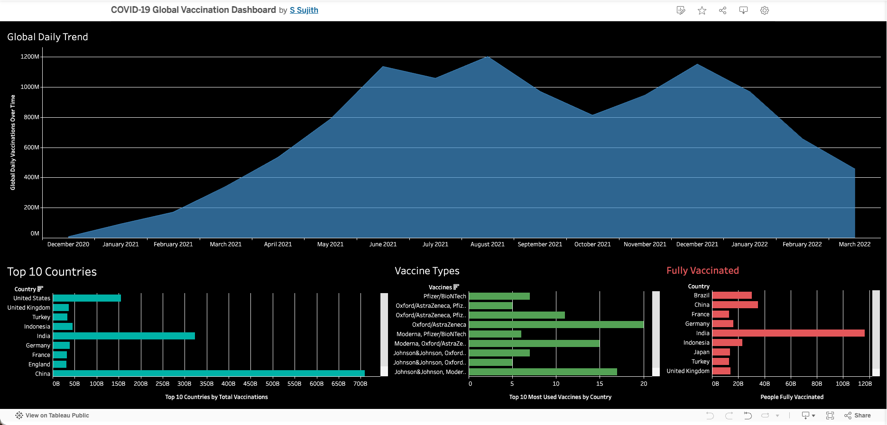
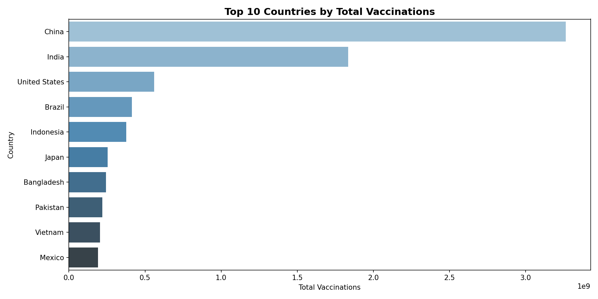
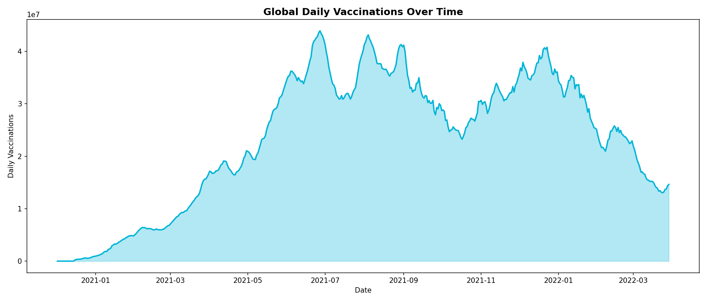
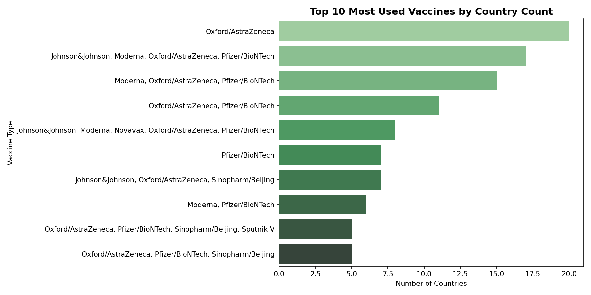
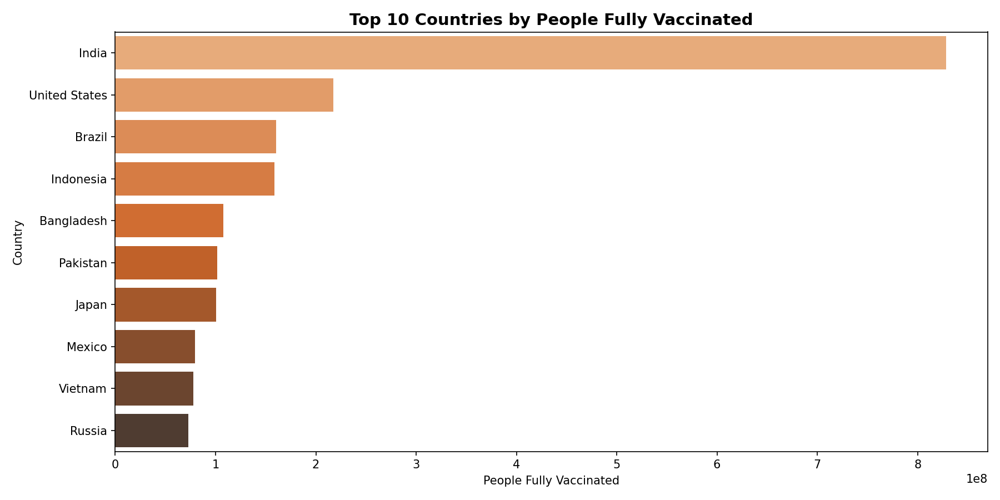

# 🌍 COVID-19 Global Vaccination Dashboard

Analyzing global COVID-19 vaccination progress across 200+ countries using publicly available WHO and Johns Hopkins data built with Python and Tableau.


## 🖥️ Dashboard Preview

<table>
  <tr>
    <td><b>📊 Tableau — Full Dashboard</b><br></td>
  </tr>
  <tr>
    <td><b>📊 Python — Top 10 Countries</b><br></td>
    <td><b>📊 Python — Global Daily Trend</b><br></td>
  </tr>
  <tr>
    <td><b>📊 Python — Vaccine Types</b><br></td>
    <td><b>📊 Python — Fully Vaccinated</b><br></td>
  </tr>
</table>


## 📊 Key Results At A Glance

| Metric | Result |
|--------|--------|
| 🌍 Countries Covered | 200+ |
| 💉 Peak Daily Vaccinations | 1.2 Billion (August 2021) |
| 🏆 Most Vaccinated Country | China |
| 💊 Most Used Vaccine | Oxford/AstraZeneca |
| 📅 Data Period | December 2020 – March 2022 |


## 🛠️ Tools & Technologies

| Tool | How I Used It |
|------|--------------|
| 🐍 Python | Data cleaning, EDA, visualization |
| 🐼 Pandas | Data manipulation |
| 📊 Matplotlib & Seaborn | Python charts |
| 📈 Tableau Public | Interactive dashboard |
| ☁️ Google Colab | Development environment |
| 🐙 GitHub | Version control |


## 🎯 Why I Built This

COVID-19 vaccination rollout was one of the most significant global health 
events in modern history. I wanted to understand how vaccination progress 
varied across countries, which vaccines were most widely adopted, and how 
daily vaccination rates evolved over time.


## 💡 Key Findings

**💉 China Led Global Vaccinations**
China administered the highest total number of vaccinations, followed by 
the United States and India. Population size played a major role in total 
numbers.

**📈 Peak in August 2021**
Global daily vaccinations peaked around August 2021 at approximately 
1.2 billion doses per day before declining through early 2022.

**💊 Oxford/AstraZeneca Most Widely Used**
Oxford/AstraZeneca was the most widely adopted vaccine globally, used 
across the highest number of countries, followed by Pfizer/BioNTech.

**🌍 Vaccination Rollout Uneven**
Developed nations showed faster early rollouts while developing nations 
caught up significantly through mid to late 2021.

---

## 📁 Project Structure
```
covid19-vaccination-dashboard/
├── country_vaccinations.csv          # Original dataset
├── covid_vaccinations_cleaned.csv    # Cleaned dataset
├── covid_latest_by_country.csv       # Latest data per country
├── covid_analysis.ipynb              # Python analysis notebook
├── tableau_dashboard.png             # Dashboard screenshot
├── top10_vaccinations.png            # Python chart
├── global_daily_trend.png            # Python chart
├── vaccine_types.png                 # Python chart
└── fully_vaccinated.png              # Python chart
```

---

## ▶️ How to Run

1. Open `covid_analysis.ipynb` in Google Colab
2. Upload `country_vaccinations.csv`
3. Run all cells in order
4. View interactive dashboard on Tableau Public

---

## 📚 Data Source

Gabriel Preda. COVID-19 World Vaccination Progress. Kaggle, 2021.
Data originally sourced from Our World in Data and WHO.


⭐ If you found this useful feel free to star the repository!
